# Warp Terminal Apps - Mermaid Diagrams

This document contains interactive Mermaid diagrams that visualize the architecture and flows. You can render these diagrams in:
- GitHub (paste into markdown files)
- Mermaid Live Editor (https://mermaid.live)
- VS Code with Mermaid extension
- Any Markdown viewer supporting Mermaid

---

## System Architecture Overview

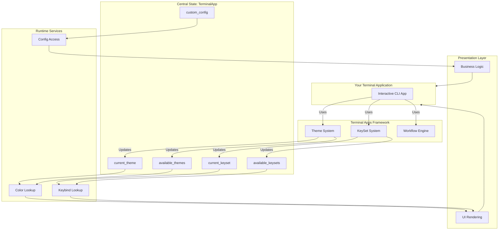

---

## Theme Loading Pipeline

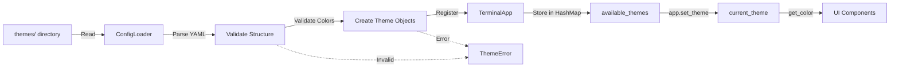

---

## Keyset Inheritance & Resolution

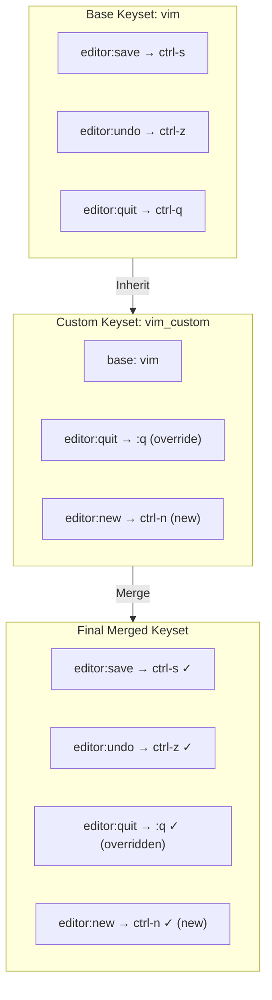

---

## Workflow Execution State Machine

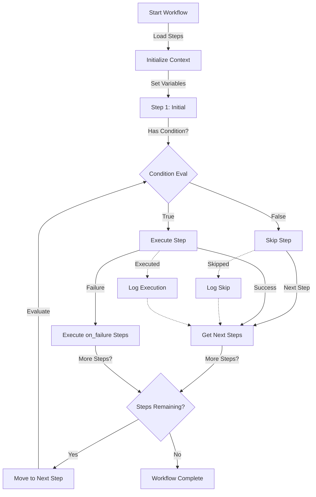

---

## Condition Evaluation Flow

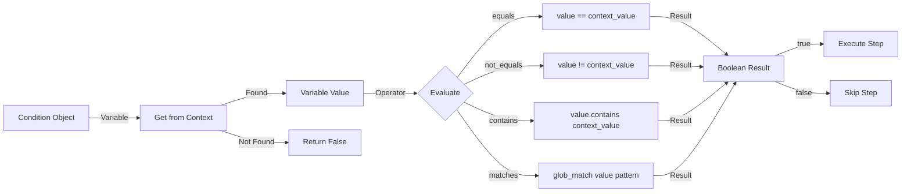

---

## Event Flow: Keybinding to Action

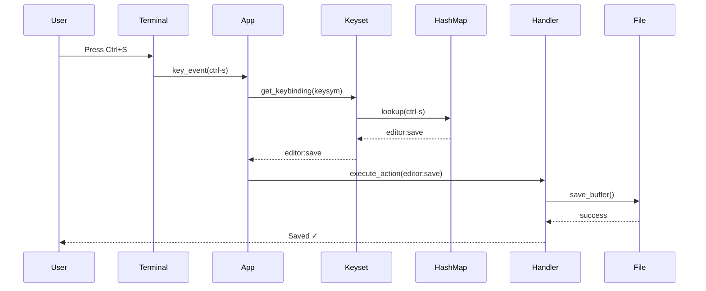

---

## Event Flow: Theme Change

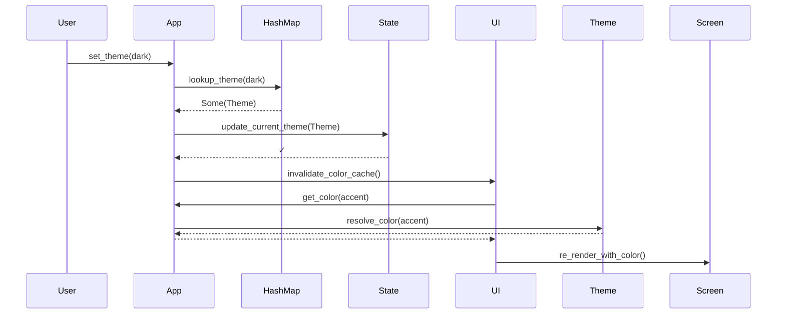

---

## Concurrent Access Pattern

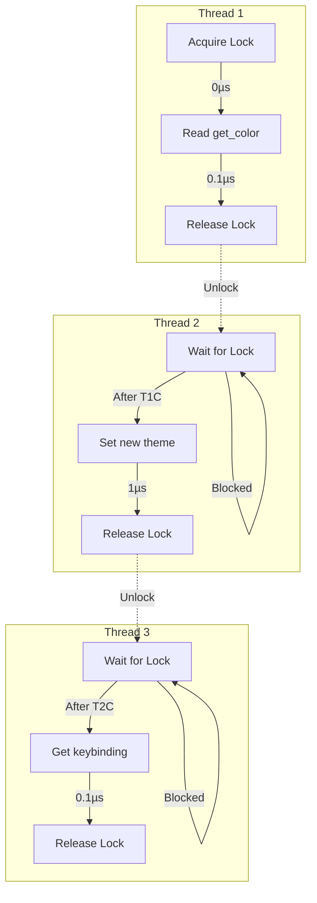

---

## Config Loading & Validation Pipeline

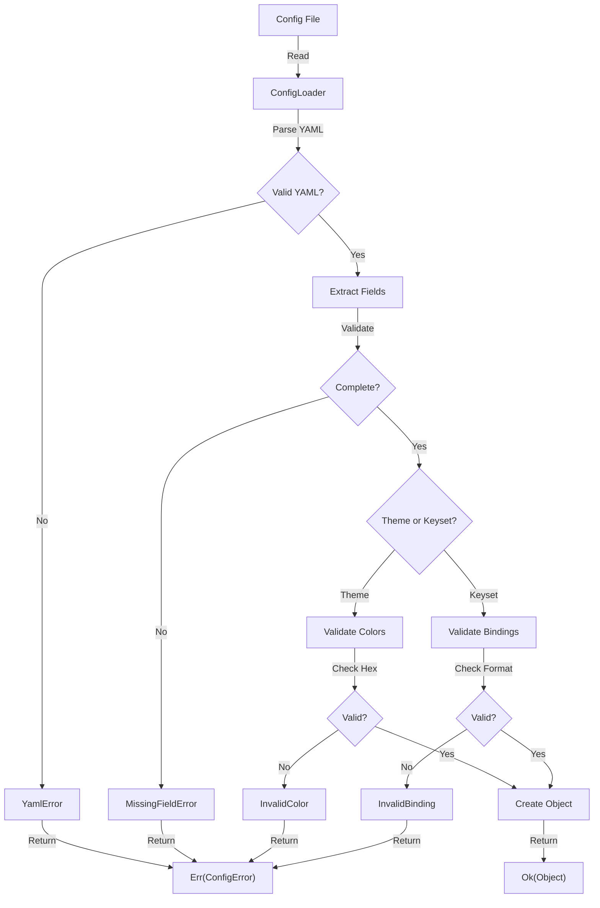

---

## Custom Theme Creation Flow

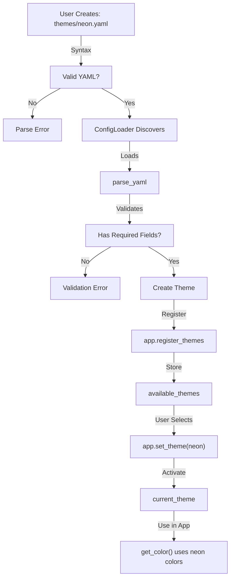

---

## Error Handling Decision Tree

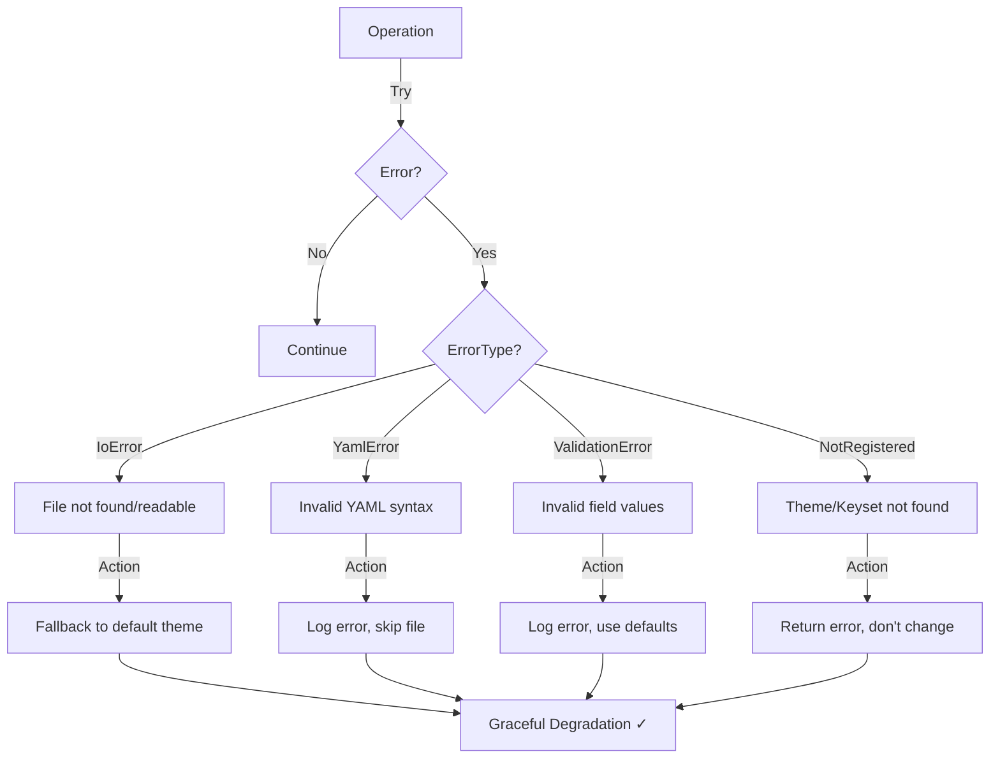

---

## Data Structure Dependencies

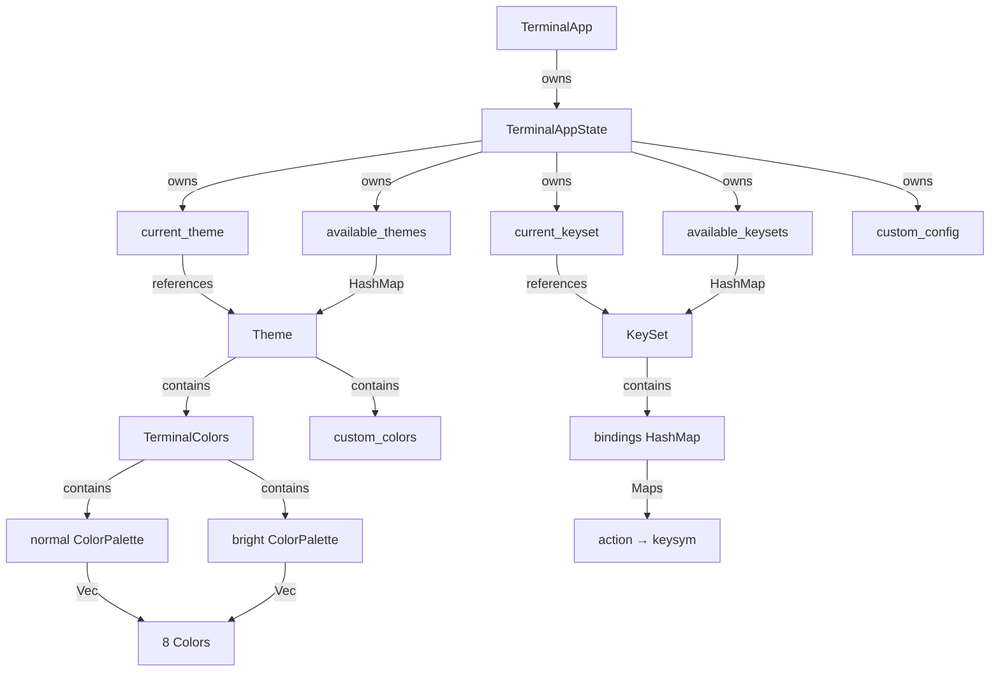

---

## Workflow Variable Resolution

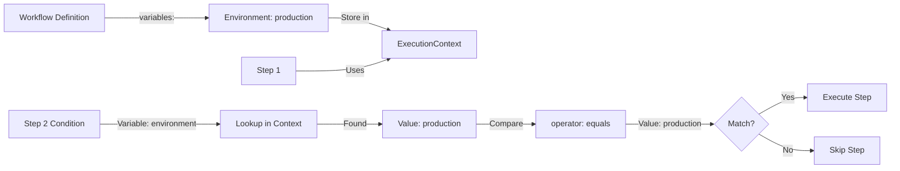

---

## Performance Characteristics

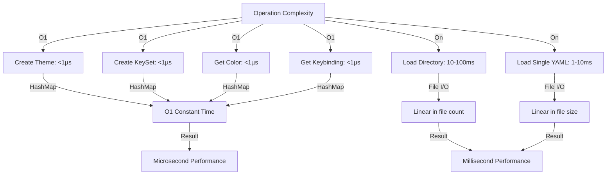

---

## Accessibility Feature Tree

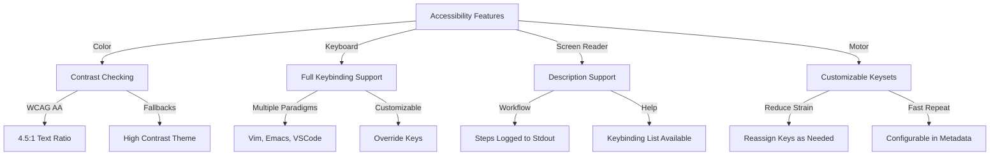

---

## Localization Architecture

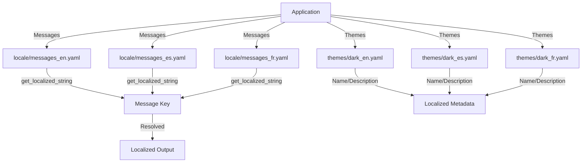

---

## Running These Diagrams

### **Option 1: Mermaid Live Editor**
1. Visit https://mermaid.live
2. Copy a diagram from above
3. Paste into the editor
4. View the rendered diagram

### **Option 2: GitHub Markdown**
1. Create a `.md` file in your repo
2. Paste diagrams in `\`\`\`mermaid` blocks
3. GitHub auto-renders them

### **Option 3: VS Code**
1. Install "Markdown Preview Mermaid Support" extension
2. View any `.md` file with diagrams
3. Preview renders automatically

### **Option 4: Local Node.js**
```bash
npm install @mermaid-js/mermaid-cli
mmdc -i MERMAID_DIAGRAMS.md -o architecture.svg
```

---

## Additional Resources

- **ARCHITECTURE.md**: Detailed ASCII diagrams and explanations
- **MODULE_DOCUMENTATION.md**: API reference for each module
- **QUICK_REFERENCE.md**: Quick lookup guide for developers
- **TERMINAL_APPS_SUMMARY.md**: Complete system overview
